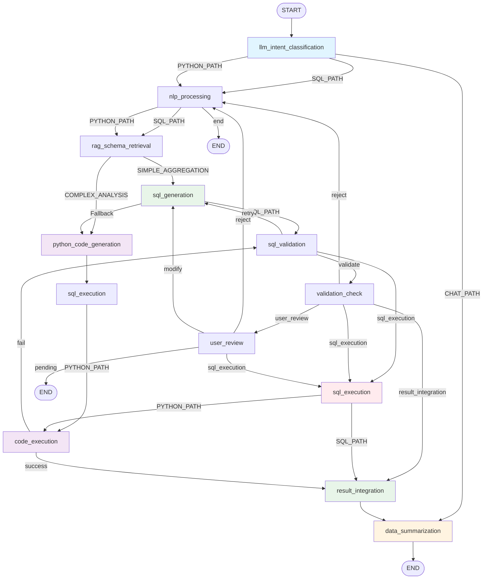

# LangGraph 아키텍처 분석 문서

## 개요

이 문서는 현재 구현된 LangGraph 상태 머신의 실제 구조를 분석하고 시각화합니다. 코드 기반으로 작성되었으며, 실제 동작하는 플로우를 정확히 반영합니다.

**작성일:** 2025-11-05  
**기반 코드:** `src/agentic_flow/graph/state_machine.py`

---

## 1. 전체 플로우 개요

### 1.1 진입점과 초기 분기

```
START
  ↓
llm_intent_classification (LLM 인텐트 분류)
  ↓
[3가지 경로로 분기]
```

**분기 기준 (`route_after_intent_classification`):**
- `CHAT_PATH`: GREETING, HELP_REQUEST, GENERAL_CHAT → `data_summarization` (직행)
- `SQL_PATH`: SIMPLE_AGGREGATION → `nlp_processing`
- `PYTHON_PATH`: COMPLEX_ANALYSIS → `nlp_processing`

### 1.2 전체 플로우 다이어그램



---

## 2. 세 가지 주요 경로 상세 분석

### 2.1 CHAT_PATH (인사/도움말 경로) 💬

**특징:**
- `nlp_processing` 노드를 **건너뛰고** 바로 `data_summarization`으로 이동
- SQL 생성 없이 대화형 응답만 생성
- 최단 경로 (Fast Path)

**플로우:**
```
START
  ↓
llm_intent_classification (GREETING/HELP_REQUEST/GENERAL_CHAT 감지)
  ↓ (CHAT_PATH)
data_summarization (대화형 응답 생성)
  ↓
END
```

**노드 실행 수:** 2개 (llm_intent_classification, data_summarization)

**코드 위치:**
- `route_after_intent_classification()`: CHAT_PATH 분기 로직
- `state_machine.py:491`: `"CHAT_PATH": "data_summarization"`

---

### 2.2 SQL_PATH (단순 집계 쿼리 경로) ⚡

**특징:**
- SIMPLE_AGGREGATION 인텐트 처리
- Fast Path 최적화 적용 (검증 통과 시 바로 실행)
- RAG 기반 스키마 검색 활용

**플로우:**
```
START
  ↓
llm_intent_classification (SIMPLE_AGGREGATION 감지)
  ↓ (SQL_PATH)
nlp_processing (엔티티 추출, 템플릿 매칭)
  ↓
rag_schema_retrieval (RAG 기반 스키마 검색)
  ↓
sql_generation (SQL 생성)
  ↓
sql_validation (SQL 검증)
  ↓ [Fast Path: confidence >= 0.5]
sql_execution (SQL 실행)
  ↓
result_integration (결과 통합)
  ↓
data_summarization (응답 생성)
  ↓
END
```

**Fast Path 조건:**
- `sql_validation`에서 `confidence >= 0.5`이면 `validation_check` 건너뛰고 바로 `sql_execution`
- `validation_check`에서 `confidence >= 0.5`이면 `user_review` 건너뛰고 바로 `sql_execution`

**재시도 경로:**
- `sql_validation` 실패 시 → `sql_generation` (재시도)
- `validation_check`에서 거부 시 → `nlp_processing` (재시작)

**노드 실행 수:** 8개 (일반 경로) / 6개 (Fast Path)

**코드 위치:**
- `route_after_nlp_processing()`: SQL_PATH 분기
- `route_after_rag_retrieval()`: sql_generation 라우팅
- `route_after_validation()`: Fast Path 로직
- `route_after_validation_check()`: 자동 승인 로직

---

### 2.3 PYTHON_PATH (복잡한 분석 쿼리 경로) 🐍

**특징:**
- COMPLEX_ANALYSIS 인텐트 처리
- SQL 생성 단계를 **건너뛰고** 바로 Python 코드 생성
- `data_gathering_sql` + `python_code` 생성 후 순차 실행

**플로우:**
```
START
  ↓
llm_intent_classification (COMPLEX_ANALYSIS 감지)
  ↓ (PYTHON_PATH)
nlp_processing (엔티티 추출, 템플릿 매칭 건너뛰기)
  ↓
rag_schema_retrieval (RAG 기반 스키마 검색)
  ↓ [SQL 생성 건너뛰기]
python_code_generation (data_gathering_sql + python_code 생성)
  ↓
sql_execution (data_gathering_sql 실행)
  ↓
code_execution (python_code 실행)
  ↓ [성공]
result_integration (결과 통합)
  ↓
data_summarization (응답 생성)
  ↓
END
```

**폴백 경로:**
- `code_execution` 실패 시 → `sql_validation` (SQL 경로로 폴백)

**최적화 사항:**
- `nlp_processing`에서 `fanding_template` 매칭 건너뛰기 (Python 경로에서는 불필요)
- `rag_schema_retrieval`에서 `sql_generation` 건너뛰고 바로 `python_code_generation`으로

**노드 실행 수:** 7개 (일반 경로) / 6개 (최적화 경로)

**코드 위치:**
- `route_after_rag_retrieval()`: python_code_generation 라우팅
- `route_after_sql_execution()`: code_execution 라우팅
- `route_after_code_execution()`: 폴백 로직

---

## 3. 노드 상세 설명

### 3.1 llm_intent_classification

**역할:** 사용자 쿼리의 의도를 LLM으로 분류

**입력:**
- `user_query`: 사용자 쿼리
- `conversation_history`: 대화 이력

**출력:**
- `llm_intent_result`: 분류 결과 (intent, confidence)
- `intent`: QueryIntent enum 값
- `conversation_response`: 비데이터 의도인 경우 응답 텍스트

**라우팅:** `route_after_intent_classification()`
- CHAT_PATH: GREETING, HELP_REQUEST, GENERAL_CHAT
- SQL_PATH: SIMPLE_AGGREGATION
- PYTHON_PATH: COMPLEX_ANALYSIS

**코드 위치:** `src/agentic_flow/llm_intent_classifier.py`

---

### 3.2 nlp_processing

**역할:** 자연어 처리 (엔티티 추출, 템플릿 매칭)

**입력:**
- `user_query`: 사용자 쿼리
- `intent`: 분류된 의도

**출력:**
- `entities`: 추출된 엔티티 리스트
- `normalized_query`: 정규화된 쿼리
- `fanding_template`: 매칭된 템플릿 (SIMPLE_AGGREGATION만)

**최적화:**
- COMPLEX_ANALYSIS 경로에서는 `fanding_template` 매칭 건너뛰기

**라우팅:** `route_after_nlp_processing()`
- SQL_PATH: rag_schema_retrieval
- PYTHON_PATH: rag_schema_retrieval
- end: needs_clarification이 True인 경우

**코드 위치:** `src/agentic_flow/nodes.py` (NLProcessor)

---

### 3.3 rag_schema_retrieval

**역할:** RAG 기반 스키마 검색 및 매핑

**입력:**
- `user_query`: 사용자 쿼리
- `entities`: 추출된 엔티티
- `intent`: 분류된 의도

**출력:**
- `rag_schema_chunks`: 검색된 스키마 청크 리스트
- `rag_schema_context`: 포맷팅된 스키마 컨텍스트
- `agent_schema_mapping`: 스키마 매핑 결과

**에러 처리:**
- 에러 발생 시 빈 값으로 설정하고 계속 진행 (폴백)

**라우팅:** `route_after_rag_retrieval()`
- sql_generation: SIMPLE_AGGREGATION
- python_code_generation: COMPLEX_ANALYSIS

**코드 위치:** `src/agentic_flow/rag_schema_retriever.py`

---

### 3.4 sql_generation

**역할:** SQL 쿼리 생성

**입력:**
- `user_query`: 사용자 쿼리
- `intent`: SIMPLE_AGGREGATION
- `entities`: 추출된 엔티티
- `rag_schema_chunks`: RAG 검색 결과
- `fanding_template`: 매칭된 템플릿 (선택적)

**출력:**
- `sql_query`: 생성된 SQL 쿼리
- `sql_params`: SQL 파라미터 (SQL Injection 방지)
- `dynamic_sql_result`: 동적 SQL 생성 결과

**라우팅:** `route_after_sql_generation()`
- sql_validation: SQL_PATH (일반)
- python_code_generation: Fallback (COMPLEX_ANALYSIS가 여기에 도달한 경우)

**코드 위치:** `src/agentic_flow/nodes.py` (SQLGenerationNode)

---

### 3.5 sql_validation

**역할:** SQL 쿼리 검증 (구문, 보안, 스키마 호환성)

**입력:**
- `sql_query`: 생성된 SQL 쿼리
- `intent`: SIMPLE_AGGREGATION

**출력:**
- `validation_result`: 검증 결과 (is_valid, confidence, issues)

**Fast Path:**
- `confidence >= 0.5`이면 `validation_check` 건너뛰고 바로 `sql_execution`

**라우팅:** `route_after_validation()`
- retry: 검증 실패 + 재시도 가능
- validate: 검증 통과 + 낮은 신뢰도
- sql_execution: Fast Path (높은 신뢰도)

**코드 위치:** `src/agentic_flow/nodes.py` (SQLValidationNode)

---

### 3.6 validation_check

**역할:** 추가 검증 및 자동 승인 결정

**입력:**
- `validation_result`: SQL 검증 결과
- `intent`: SIMPLE_AGGREGATION

**출력:**
- `processing_decision`: 처리 결정 (auto_approve, needs_user_review)

**자동 승인 조건:**
- SIMPLE_AGGREGATION + `confidence >= 0.5`: 자동 승인
- 높은 신뢰도 (`confidence >= 0.85`): 자동 승인

**라우팅:** `route_after_validation_check()`
- sql_execution: 자동 승인 또는 사용자 승인
- user_review: 사용자 검토 필요
- reject: 거부 (재시작)
- result_integration: 이미 SQL 실행된 경우 (일반적으로 발생하지 않음)

**코드 위치:** `src/agentic_flow/validation_node.py`

---

### 3.7 user_review

**역할:** 사용자 검토 및 승인

**입력:**
- `review_status`: 검토 상태
- `review_result`: 검토 결과

**출력:**
- `review_status`: 업데이트된 검토 상태

**라우팅:** `route_after_user_review()`
- sql_execution: 사용자 승인
- reject: 거부 (재시작)
- modify: 수정 (SQL 재생성)
- pending: 대기 중 (END)

**코드 위치:** `src/agentic_flow/user_review_node.py`

---

### 3.8 sql_execution

**역할:** SQL 쿼리 실행

**입력:**
- `sql_query` 또는 `validated_sql`: 실행할 SQL 쿼리
- `sql_params`: SQL 파라미터
- `data_gathering_sql`: Python 경로용 SQL (선택적)

**출력:**
- `query_result`: 쿼리 실행 결과
- `execution_time`: 실행 시간

**특수 처리:**
- PYTHON_PATH: `data_gathering_sql` 사용
- `skip_sql_generation=True`: SQL 실행 건너뛰기

**라우팅:** `route_after_sql_execution()`
- result_integration: SQL_PATH
- code_execution: PYTHON_PATH (python_code가 있는 경우)

**코드 위치:** `src/agentic_flow/graph/state_machine.py` (`_execute_sql_query()`)

---

### 3.9 python_code_generation

**역할:** Python 코드 생성 (복잡한 분석용)

**입력:**
- `user_query`: 사용자 쿼리
- `intent`: COMPLEX_ANALYSIS
- `rag_schema_chunks`: RAG 검색 결과

**출력:**
- `data_gathering_sql`: 데이터 수집용 SQL
- `python_code`: 분석용 Python 코드

**라우팅:** 직접 연결 (엣지)
- `python_code_generation` → `sql_execution`

**코드 위치:** `src/agentic_flow/python_code_generator.py`

---

### 3.10 code_execution

**역할:** Python 코드 실행 (샌드박스)

**입력:**
- `python_code`: 실행할 Python 코드
- `query_result`: `data_gathering_sql` 실행 결과

**출력:**
- `python_execution_result`: 실행 결과 (success, result, error_message)

**라우팅:** `route_after_code_execution()`
- result_integration: 성공
- sql_validation: 실패 (SQL 경로로 폴백)

**코드 위치:** `src/agentic_flow/code_executor.py`

---

### 3.11 result_integration

**역할:** SQL/Python 결과 통합

**입력:**
- `query_result`: SQL 실행 결과
- `python_execution_result`: Python 실행 결과 (선택적)

**출력:**
- `query_result`: 통합된 결과

**라우팅:** 직접 연결 (엣지)
- `result_integration` → `data_summarization`

**코드 위치:** `src/agentic_flow/result_integrator.py`

---

### 3.12 data_summarization

**역할:** 최종 응답 생성

**입력:**
- `query_result`: 통합된 결과
- `user_query`: 사용자 쿼리
- `intent`: 분류된 의도
- `conversation_response`: 대화형 응답 (CHAT_PATH)

**출력:**
- `data_summary`: 최종 응답 텍스트
- `conversation_history`: 업데이트된 대화 이력

**라우팅:** 직접 연결 (엣지)
- `data_summarization` → `END`

**코드 위치:** `src/agentic_flow/nodes.py` (DataSummarizationNode)

---

## 4. 라우팅 함수 상세 분석

### 4.1 route_after_intent_classification()

**위치:** `state_machine.py:700`

**로직:**
1. `llm_intent_result` 확인
2. Intent 추출 및 검증
3. CHAT_PATH: GREETING, HELP_REQUEST, GENERAL_CHAT
4. SQL_PATH: SIMPLE_AGGREGATION
5. PYTHON_PATH: COMPLEX_ANALYSIS
6. Fallback: SQL_PATH (안전한 기본값)

**최적화:**
- CHAT_PATH는 `nlp_processing` 건너뛰고 바로 `data_summarization`으로

---

### 4.2 route_after_nlp_processing()

**위치:** `state_machine.py:905`

**로직:**
1. `needs_clarification` 확인 → `end` (조기 종료)
2. SQL_PATH: SIMPLE_AGGREGATION → `rag_schema_retrieval`
3. PYTHON_PATH: COMPLEX_ANALYSIS → `rag_schema_retrieval`
4. Fallback: SQL_PATH

**최적화:**
- `schema_mapping` 노드 제거, `rag_schema_retrieval`로 직접 연결

---

### 4.3 route_after_rag_retrieval()

**위치:** `state_machine.py:799`

**로직:**
1. Intent 확인
2. PYTHON_PATH: COMPLEX_ANALYSIS → `python_code_generation` (SQL 생성 건너뛰기)
3. SQL_PATH: SIMPLE_AGGREGATION → `sql_generation`
4. Fallback: `sql_generation` (안전한 기본값)

**최적화:**
- COMPLEX_ANALYSIS는 SQL 생성 단계를 건너뛰고 바로 Python 코드 생성으로

---

### 4.4 route_after_sql_generation()

**위치:** `state_machine.py:1161`

**로직:**
1. SQL_PATH: SIMPLE_AGGREGATION → `sql_validation`
2. Fallback: COMPLEX_ANALYSIS가 여기에 도달한 경우 → `python_code_generation`

**참고:**
- 일반적으로 COMPLEX_ANALYSIS는 `rag_schema_retrieval`에서 이미 `python_code_generation`으로 라우팅됨

---

### 4.5 route_after_validation()

**위치:** `state_machine.py:982`

**로직:**
1. SIMPLE_AGGREGATION Fast Path: `confidence >= 0.5` → `sql_execution`
2. 검증 통과 → `validate` (validation_check)
3. 검증 실패 + 재시도 가능 → `retry` (sql_generation)
4. 재시도 초과 → `validate` (validation_check)

**Fast Path 조건:**
- `confidence >= 0.5`: `validation_check` 건너뛰고 바로 실행

---

### 4.6 route_after_validation_check()

**위치:** `state_machine.py:1064`

**로직:**
1. SIMPLE_AGGREGATION 자동 승인: `confidence >= 0.5` → `sql_execution`
2. 높은 신뢰도 (`confidence >= 0.85`): 자동 승인
3. 사용자 검토 필요 → `user_review`
4. 거부 → `reject` (nlp_processing)

**자동 승인 조건:**
- SIMPLE_AGGREGATION + `confidence >= 0.5`: 자동 승인

---

### 4.7 route_after_sql_execution()

**위치:** `state_machine.py:1196`

**로직:**
1. PYTHON_PATH: `python_code`가 있으면 → `code_execution`
2. SQL_PATH: → `result_integration`

**참고:**
- PYTHON_PATH는 `sql_execution`에서 `data_gathering_sql`을 실행한 후 `code_execution`으로 이동

---

### 4.8 route_after_code_execution()

**위치:** `state_machine.py:1229`

**로직:**
1. 성공: → `result_integration`
2. 실패: → `sql_validation` (SQL 경로로 폴백)

**폴백 전략:**
- Python 실행 실패 시 SQL 경로로 전환하여 재시도

---

### 4.9 route_after_user_review()

**위치:** `state_machine.py:1255`

**로직:**
1. AUTO_APPROVED: → `sql_execution`
2. PENDING: → `pending` (END)
3. APPROVED: → `sql_execution`
4. REJECTED: → `reject` (nlp_processing)
5. MODIFIED: → `modify` (sql_generation)

---

## 5. 상태 관리 (AgentState)

### 5.1 주요 필드

**입력:**
- `user_query`: 사용자 쿼리
- `user_id`: 사용자 ID
- `channel_id`: 채널 ID
- `session_id`: 세션 ID
- `conversation_history`: 대화 이력

**처리 단계:**
- `intent`: 분류된 의도
- `entities`: 추출된 엔티티
- `rag_schema_chunks`: RAG 검색 결과
- `sql_query`: 생성된 SQL
- `sql_params`: SQL 파라미터
- `query_result`: 쿼리 실행 결과

**대화 처리:**
- `conversation_response`: 대화형 응답
- `skip_sql_generation`: SQL 생성 건너뛰기 플래그
- `needs_clarification`: 명확화 필요 플래그

**검증 및 검토:**
- `validation_result`: 검증 결과
- `review_status`: 검토 상태
- `review_result`: 검토 결과

**출력:**
- `final_sql`: 최종 SQL
- `data_summary`: 최종 응답
- `success`: 성공 여부

**디버깅:**
- `debug_info`: 디버깅 정보 (node_performance, routing_decisions)

---

## 6. 최적화 사항

### 6.1 CHAT_PATH 최적화

- `nlp_processing` 노드 건너뛰기
- 바로 `data_summarization`으로 직행
- 노드 실행 수: 2개 (최소)

### 6.2 SQL_PATH Fast Path

- `sql_validation`에서 `confidence >= 0.5`이면 `validation_check` 건너뛰기
- `validation_check`에서 `confidence >= 0.5`이면 `user_review` 건너뛰기
- 노드 실행 수: 6개 (Fast Path) / 8개 (일반 경로)

### 6.3 PYTHON_PATH 최적화

- `nlp_processing`에서 `fanding_template` 매칭 건너뛰기
- `rag_schema_retrieval`에서 `sql_generation` 건너뛰고 바로 `python_code_generation`으로
- 노드 실행 수: 6개 (최적화 경로) / 7개 (일반 경로)

### 6.4 노드 제거

- `schema_mapping` 노드 제거 → `rag_schema_retrieval`에 통합
- `dynamic_sql_generation` 노드 제거 → `sql_generation`에 통합

---

## 7. 성능 모니터링

### 7.1 성능 래퍼

모든 노드는 `_create_performance_wrapper()`로 래핑되어:
- 실행 시간 측정
- 성공/실패 추적
- 노드별 메타데이터 수집

### 7.2 병목 지점 분석

`_identify_bottlenecks()` 함수가:
- 총 실행 시간의 20% 이상을 차지하는 노드를 병목으로 식별
- 최적화 제안 생성

**일반적인 병목:**
- `nlp_processing`: 50% 이상 (템플릿 매칭, 엔티티 추출)
- `sql_generation`: 30-40% (LLM 호출)

---

## 8. 에러 처리 및 폴백

### 8.1 RAG 검색 실패

- 에러 발생 시 빈 값으로 설정하고 계속 진행
- RAG 없이도 SQL 생성 가능 (폴백)

### 8.2 Python 실행 실패

- `code_execution` 실패 시 SQL 경로로 폴백
- `sql_validation`부터 재시도

### 8.3 SQL 검증 실패

- 재시도 가능하면 `sql_generation`으로 재시도
- 재시도 초과 시 `validation_check`에서 최종 결정

---

## 9. 결론

현재 LangGraph 구조는 **Intent-First Architecture**를 기반으로 하며, 세 가지 명확한 경로로 분기됩니다:

1. **CHAT_PATH**: 최단 경로 (2개 노드)
2. **SQL_PATH**: Fast Path 최적화 (6-8개 노드)
3. **PYTHON_PATH**: SQL 생성 건너뛰기 (6-7개 노드)

각 경로는 최적화되어 불필요한 노드를 건너뛰며, 성능 모니터링과 폴백 메커니즘이 구현되어 있습니다.

---

## 부록: 코드 참조

- **메인 파일:** `src/agentic_flow/graph/state_machine.py`
- **노드 구현:** `src/agentic_flow/nodes.py`
- **인텐트 분류:** `src/agentic_flow/llm_intent_classifier.py`
- **RAG 검색:** `src/agentic_flow/rag_schema_retriever.py`
- **Python 코드 생성:** `src/agentic_flow/python_code_generator.py`
- **코드 실행:** `src/agentic_flow/code_executor.py`
- **결과 통합:** `src/agentic_flow/result_integrator.py`

