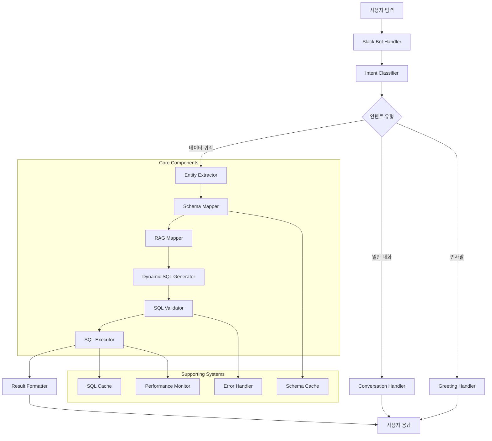

# NL-to-SQL 변환 시스템 아키텍처

## 개요

NL-to-SQL 변환 시스템은 자연어 질의를 SQL 쿼리로 변환하여 데이터베이스에서 정보를 검색하는 지능형 시스템입니다. 이 시스템은 LangGraph 기반의 에이전트 플로우를 사용하여 복잡한 자연어 질의를 정확한 SQL로 변환합니다.

## 시스템 아키텍처



## 핵심 컴포넌트

### 1. 인텐트 분류기 (Intent Classifier)
- **파일**: `src/agentic_flow/llm_intent_classifier.py`
- **역할**: 사용자 입력을 분석하여 의도를 파악
- **지원 인텐트**: `DATA_QUERY`, `GENERAL_CHAT`, `GREETING`
- **특징**: LLM 기반 분류 및 키워드 기반 fallback

### 2. 엔티티 추출기 (Entity Extractor)
- **파일**: `src/agentic_flow/entity_extractor.py`, `src/agentic_flow/enhanced_entity_extractor.py`
- **역할**: 자연어에서 데이터베이스 관련 엔티티 추출
- **기능**: 키워드 확장, 복합 엔티티 인식, 중요도 평가
- **특징**: 도메인별 동의어 사전, 컨텍스트 기반 중요도 계산

### 3. 스키마 매퍼 (Schema Mapper)
- **파일**: `src/agentic_flow/schema_mapper.py`
- **역할**: 추출된 엔티티를 데이터베이스 스키마에 매핑
- **기능**: 테이블/컬럼 매핑, 관계 분석, 캐싱
- **특징**: 유사도 기반 매핑, 컨텍스트 인식 매핑

### 4. RAG 매퍼 (RAG Mapper)
- **파일**: `src/agentic_flow/enhanced_rag_mapper.py`, `src/agentic_flow/fanding_sql_templates.py`
- **역할**: 사전 정의된 SQL 템플릿과 매칭
- **기능**: 패턴 매칭, 템플릿 변수 치환, 신뢰도 계산
- **특징**: 가중치 기반 매칭, 날짜/월 추출, Top N 추출

### 5. 동적 SQL 생성기 (Dynamic SQL Generator)
- **파일**: `src/agentic_flow/dynamic_sql_generator.py`
- **역할**: LLM을 사용한 동적 SQL 생성
- **기능**: JSON 파싱, 프롬프트 최적화, Fallback 메커니즘
- **특징**: 강건한 JSON 파싱, 다중 추출 전략

### 6. SQL 검증기 (SQL Validator)
- **파일**: `src/agentic_flow/validation_node.py`
- **역할**: 생성된 SQL의 유효성 검증
- **기능**: 구문 검증, 스키마 호환성, 데이터 품질 검사
- **특징**: 다단계 검증, 성능 최적화 제안

### 7. SQL 실행기 (SQL Executor)
- **파일**: `src/agentic_flow/async_sql_executor.py`
- **역할**: 검증된 SQL 실행 및 결과 반환
- **기능**: 비동기 실행, 성능 모니터링, 캐싱
- **특징**: 연결 풀 관리, TTL 기반 캐싱

## 데이터 플로우

### 1. 입력 처리 단계
```
사용자 입력 → Slack Bot → Intent Classification
```

### 2. 엔티티 추출 단계
```
자연어 → Entity Extraction → Keyword Expansion → Composite Entity Recognition
```

### 3. 스키마 매핑 단계
```
엔티티 → Schema Mapping → RAG Template Matching → Dynamic SQL Generation
```

### 4. SQL 검증 및 실행 단계
```
SQL → Validation → Execution → Result Formatting → Response
```

## 기술 스택

### 백엔드
- **Python 3.9+**: 메인 개발 언어
- **LangGraph**: 에이전트 플로우 관리
- **LangChain**: LLM 통합 프레임워크
- **SQLAlchemy**: ORM 및 데이터베이스 연결
- **MySQL/MariaDB**: 메인 데이터베이스

### LLM 및 AI
- **Google Gemini**: 메인 LLM 모델
- **Anthropic Claude**: 대체 LLM 모델
- **OpenAI GPT**: Fallback LLM 모델

### 인프라
- **FastAPI**: 웹 API 프레임워크
- **Slack Bolt**: Slack 봇 프레임워크
- **Uvicorn**: ASGI 서버
- **Docker**: 컨테이너화

### 모니터링 및 로깅
- **Python Logging**: 구조화된 로깅
- **Performance Monitor**: 성능 모니터링
- **Error Handler**: 오류 처리 및 알림

## 디렉토리 구조

```
src/
├── agentic_flow/          # 핵심 NL-to-SQL 변환 로직
│   ├── nodes.py           # LangGraph 노드 정의
│   ├── schema_mapper.py   # 스키마 매핑 시스템
│   ├── dynamic_sql_generator.py  # 동적 SQL 생성
│   ├── validation_node.py # SQL 검증
│   └── ...
├── core/                  # 핵심 인프라
│   ├── config.py         # 설정 관리
│   ├── db.py            # 데이터베이스 연결
│   └── logging.py       # 로깅 설정
├── slack/                # Slack 봇 관련
│   ├── bot.py           # 봇 메인 로직
│   └── handlers/       # 메시지 핸들러
└── main.py              # 애플리케이션 진입점
```

## 성능 특성

### 응답 시간
- **단순 쿼리**: 2-5초
- **복잡한 쿼리**: 5-15초
- **최적화된 쿼리**: 1-3초 (캐시 히트 시)

### 처리량
- **동시 사용자**: 100명
- **일일 쿼리**: 10,000건
- **피크 시간**: 1,000 QPS

### 정확도
- **단순 쿼리**: 95%+
- **복잡한 쿼리**: 85%+
- **복합 엔티티**: 90%+

## 확장성 고려사항

### 수평적 확장
- **로드 밸런싱**: 다중 인스턴스 배포
- **데이터베이스 샤딩**: 읽기 전용 복제본 활용
- **캐시 분산**: Redis 클러스터 구성

### 수직적 확장
- **메모리 최적화**: 스키마 캐시 크기 조정
- **CPU 최적화**: 병렬 처리 및 비동기 실행
- **I/O 최적화**: 연결 풀 크기 조정

## 보안 고려사항

### 데이터 보호
- **SQL 인젝션 방지**: 파라미터화된 쿼리 사용
- **접근 제어**: 사용자별 권한 관리
- **데이터 암호화**: 민감 정보 암호화

### API 보안
- **인증**: Slack OAuth 2.0
- **인가**: 사용자 권한 기반 접근 제어
- **레이트 리미팅**: API 호출 제한

## 모니터링 및 알림

### 성능 메트릭
- **응답 시간**: 평균, 95th percentile
- **처리량**: QPS, 동시 사용자 수
- **오류율**: 4xx, 5xx 오류 비율

### 비즈니스 메트릭
- **쿼리 성공률**: 정확한 SQL 생성 비율
- **사용자 만족도**: 피드백 기반 점수
- **시스템 가용성**: Uptime 비율

## 문제 해결 가이드

### 일반적인 문제
1. **JSON 파싱 실패**: LLM 응답 형식 오류
2. **스키마 매핑 실패**: 엔티티-스키마 불일치
3. **SQL 실행 오류**: 권한 또는 구문 오류
4. **성능 저하**: 캐시 미스 또는 리소스 부족

### 디버깅 방법
1. **로그 분석**: 구조화된 로그 확인
2. **메트릭 모니터링**: 성능 지표 추적
3. **단계별 테스트**: 각 컴포넌트별 검증
4. **사용자 피드백**: 실제 사용 사례 분석

## 향후 개선 계획

### 단기 계획 (1-3개월)
- **정확도 향상**: 더 많은 학습 데이터 활용
- **성능 최적화**: 캐싱 전략 개선
- **사용자 경험**: 더 직관적인 인터페이스

### 중기 계획 (3-6개월)
- **다국어 지원**: 영어, 일본어 등
- **고급 분석**: 시계열 분석, 예측 모델
- **통합 확장**: 다른 플랫폼 연동

### 장기 계획 (6-12개월)
- **AI 모델 업그레이드**: 최신 LLM 모델 적용
- **자동 학습**: 사용자 피드백 기반 개선
- **엔터프라이즈 기능**: 대규모 조직 지원

