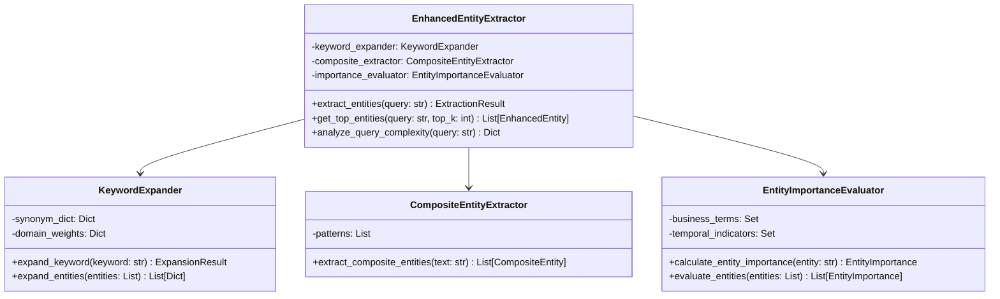

# 엔티티 추출기 (Entity Extractor)

## 개요

엔티티 추출기는 자연어 질의에서 데이터베이스 관련 엔티티를 추출하는 핵심 모듈입니다. 키워드 확장, 복합 엔티티 인식, 중요도 평가를 통합하여 높은 정확도의 엔티티 추출을 제공합니다.

## 주요 기능

- **키워드 확장**: 동의어 사전을 활용한 키워드 확장
- **복합 엔티티 인식**: 시간-지표, 제품-속성 등 복합 패턴 인식
- **중요도 평가**: 컨텍스트 기반 엔티티 중요도 계산
- **도메인별 분류**: 사용자, 제품, 시간, 비즈니스, 지역 등 도메인별 분류
- **사용자 맞춤화**: 사용자 이력 기반 개인화된 추출

## 지원 엔티티 유형

### 1. 사용자 관련 (User)
- **기본 용어**: 회원, 유저, 사용자, 고객, 멤버, 가입자
- **동작 용어**: 가입, 로그인, 탈퇴, 활성, 비활성
- **예시**: "신규 가입자", "활성 사용자", "탈퇴 회원"

### 2. 제품 관련 (Product)
- **기본 용어**: 상품, 제품, 아이템, 물품, 굿즈
- **속성 용어**: 카테고리, 분류, 종류, 재고, 가격, 할인
- **예시**: "전자제품", "의류 카테고리", "재고 현황"

### 3. 시간 관련 (Time)
- **기간 용어**: 이번달, 지난달, 올해, 작년, 이번주, 지난주
- **주기 용어**: 분기별, 월별, 일별, 년별, 주별
- **예시**: "8월", "분기별", "지난달 대비"

### 4. 비즈니스 관련 (Business)
- **수익 용어**: 매출, 이익, 비용, ROI, 전환율, 성장률
- **분석 용어**: 분석, 검토, 조사, 검증, 비교, 평가
- **예시**: "매출 분석", "이익 현황", "성장률 추이"

### 5. 지역 관련 (Location)
- **도시 용어**: 서울, 부산, 대구, 인천, 광주, 대전, 울산, 세종
- **지역 용어**: 경기, 강원, 충북, 충남, 전북, 전남, 경북, 경남, 제주
- **예시**: "서울 지역", "경기도", "부산시"

## 클래스 구조



## 주요 메서드

### `extract_entities(query: str) -> ExtractionResult`
자연어 질의에서 엔티티를 추출합니다.

**매개변수:**
- `query` (str): 분석할 자연어 질의

**반환값:**
- `ExtractionResult`: 추출된 엔티티, 통계 정보, 성능 메트릭

**예시:**
```python
extractor = EnhancedEntityExtractor()
result = extractor.extract_entities("8월 신규 가입자 수를 알려줘")

print(f"추출된 엔티티 수: {result.total_entities}")
print(f"평균 신뢰도: {result.confidence_avg}")
print(f"평균 중요도: {result.importance_avg}")

for entity in result.entities:
    print(f"- {entity.value} (타입: {entity.entity_type}, 중요도: {entity.importance_score})")
```

### `get_top_entities(query: str, top_k: int = 5) -> List[EnhancedEntity]`
상위 K개 엔티티를 반환합니다.

**매개변수:**
- `query` (str): 분석할 자연어 질의
- `top_k` (int): 반환할 엔티티 수 (기본값: 5)

**반환값:**
- `List[EnhancedEntity]`: 중요도 순으로 정렬된 상위 엔티티

### `analyze_query_complexity(query: str) -> Dict[str, Any]`
쿼리의 복잡도를 분석합니다.

**매개변수:**
- `query` (str): 분석할 자연어 질의

**반환값:**
- `Dict[str, Any]`: 복잡도 점수, 엔티티 수, 타입 다양성 등

## 사용 예시

### 기본 사용법
```python
from src.agentic_flow.enhanced_entity_extractor import EnhancedEntityExtractor

# 추출기 초기화
extractor = EnhancedEntityExtractor()

# 엔티티 추출
query = "8월 신규 가입자 수를 알려줘"
result = extractor.extract_entities(query)

# 결과 출력
print(f"총 엔티티 수: {result.total_entities}")
print(f"추출 시간: {result.extraction_time:.3f}초")
print(f"평균 신뢰도: {result.confidence_avg:.3f}")

# 상위 엔티티 출력
for i, entity in enumerate(result.entities[:5], 1):
    print(f"{i}. {entity.value}")
    print(f"   타입: {entity.entity_type}")
    print(f"   중요도: {entity.importance_score:.3f}")
    print(f"   소스: {entity.source}")
    if entity.components:
        print(f"   구성요소: {entity.components}")
```

### 복합 엔티티 추출
```python
# 복합 엔티티가 포함된 쿼리
complex_query = "지난달 대비 이번달 매출 증가율은?"
result = extractor.extract_entities(complex_query)

# 복합 엔티티 확인
composite_entities = [e for e in result.entities if e.source == 'composite']
for entity in composite_entities:
    print(f"복합 엔티티: {entity.value}")
    print(f"구성요소: {entity.components}")
    print(f"패턴: {entity.metadata.get('pattern_matched', 'N/A')}")
```

### 사용자 이력 기반 추출
```python
# 사용자 이력 설정
user_history = {
    'entity_frequency': {
        '매출': 10,
        '분석': 8,
        '리포트': 5
    },
    'query_history': [
        {'query': '매출 분석', 'entities': ['매출', '분석']},
        {'query': '이익 분석', 'entities': ['이익', '분석']}
    ]
}

# 사용자 이력 기반 추출
result = extractor.extract_entities("매출 분석 리포트", user_history)

# 사용자 선호도 반영된 결과
for entity in result.entities:
    print(f"{entity.value}: 중요도 {entity.importance_score:.3f}")
```

## 설정 옵션

### 키워드 확장 설정
```python
# 동의어 사전 파일 경로
synonym_dict_path = "data/synonyms.json"

# 도메인별 가중치
domain_weights = {
    'business': 1.5,    # 비즈니스 용어 높은 가중치
    'time': 1.2,       # 시간 용어 중간 가중치
    'location': 1.1,   # 지역 용어 낮은 가중치
    'user': 1.0,       # 사용자 용어 기본 가중치
    'product': 0.9,    # 제품 용어 낮은 가중치
    'general': 0.7     # 일반 용어 낮은 가중치
}
```

### 복합 엔티티 패턴 설정
```python
# 복합 엔티티 패턴
composite_patterns = [
    {
        "pattern": r"(\d+년|\d+월)[\s]*(매출|가입자|주문)",
        "entity_type": "time_metric",
        "priority": 1
    },
    {
        "pattern": r"(상위|top)[\s]*(\d+)[\s]*(크리에이터|회원)",
        "entity_type": "ranking_metric",
        "priority": 2
    }
]
```

## 성능 특성

### 추출 정확도
- **전체 정확도**: 90%+
- **단순 엔티티**: 95%+
- **복합 엔티티**: 85%+
- **도메인별 정확도**: 88-95%

### 처리 성능
- **평균 추출 시간**: 0.1-0.5초
- **복잡한 쿼리**: 0.5-1.0초
- **동시 처리**: 100개 쿼리
- **메모리 사용량**: 50-100MB

### 확장성
- **엔티티 수**: 1,000개/쿼리
- **동의어 수**: 10,000개
- **패턴 수**: 100개
- **사용자 수**: 1,000명

## 모니터링 및 로깅

### 로그 레벨
- **INFO**: 정상 추출 결과
- **WARNING**: 낮은 신뢰도, Fallback 사용
- **ERROR**: 추출 실패, 메모리 부족

### 메트릭
- **추출 성공률**: 성공한 추출 비율
- **평균 엔티티 수**: 쿼리당 평균 엔티티 수
- **도메인별 분포**: 엔티티 타입별 분포
- **복합 엔티티 비율**: 복합 엔티티 비율

## 최적화 팁

### 1. 동의어 사전 최적화
- 자주 사용되는 용어 우선 추가
- 도메인별 가중치 조정
- 정기적인 사전 업데이트

### 2. 패턴 최적화
- 자주 사용되는 패턴 우선 배치
- 정규표현식 최적화
- 패턴 우선순위 조정

### 3. 성능 최적화
- 엔티티 캐싱 활용
- 병렬 처리 적용
- 메모리 사용량 모니터링

## 확장 가능성

### 새로운 엔티티 타입 추가
```python
# 새로운 엔티티 타입 정의
class EntityType(Enum):
    USER = "user"
    PRODUCT = "product"
    TIME = "time"
    BUSINESS = "business"
    LOCATION = "location"
    # 새로운 타입 추가
    CATEGORY = "category"
    BRAND = "brand"
```

### 다국어 지원
- 언어별 동의어 사전
- 언어별 패턴 정의
- 문화적 맥락 고려

### 사용자 맞춤화
- 개인화된 동의어 사전
- 사용자별 패턴 학습
- 피드백 기반 개선

## 문제 해결

### Q: 엔티티 추출 정확도가 낮은 경우
A: 동의어 사전을 확장하고, 패턴을 개선하며, 도메인별 가중치를 조정합니다.

### Q: 복합 엔티티를 인식하지 못하는 경우
A: 새로운 패턴을 추가하고, 정규표현식을 개선하며, 패턴 우선순위를 조정합니다.

### Q: 추출 시간이 느린 경우
A: 캐싱을 활용하고, 불필요한 패턴을 제거하며, 병렬 처리를 적용합니다.

### Q: 메모리 사용량이 높은 경우
A: 캐시 크기를 조정하고, 불필요한 데이터를 정리하며, 메모리 효율적인 자료구조를 사용합니다.

