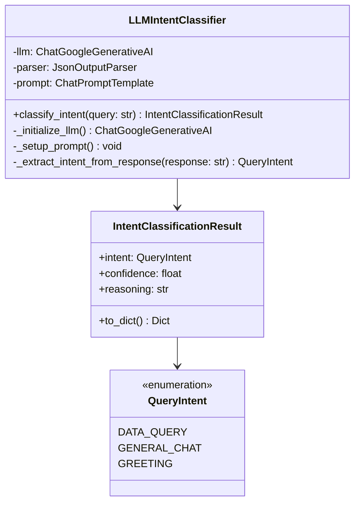

# 인텐트 분류기 (Intent Classifier)

## 개요

인텐트 분류기는 사용자의 자연어 입력을 분석하여 의도를 파악하는 핵심 모듈입니다. LLM 기반 분류와 키워드 기반 fallback을 결합하여 높은 정확도와 빠른 응답 속도를 제공합니다.

## 주요 기능

- **LLM 기반 분류**: Google Gemini 모델을 사용한 지능형 인텐트 분류
- **키워드 기반 Fallback**: LLM 실패 시 키워드 매칭으로 분류
- **다중 인텐트 지원**: 데이터 쿼리, 일반 대화, 인사말 등 구분
- **신뢰도 평가**: 분류 결과에 대한 신뢰도 점수 제공
- **빠른 응답**: 최적화된 프롬프트로 응답 시간 단축

## 지원 인텐트 유형

### 1. DATA_QUERY
데이터베이스 조회를 요청하는 질의
- **예시**: "8월 신규 가입자 수를 알려줘", "매출 현황 분석"
- **특징**: 데이터 관련 키워드 포함, 구체적인 정보 요청

### 2. GENERAL_CHAT
일반적인 대화나 질문
- **예시**: "안녕하세요", "오늘 날씨가 어떤가요?"
- **특징**: 데이터 조회와 무관한 일반적인 대화

### 3. GREETING
인사말이나 환영 메시지
- **예시**: "안녕", "좋은 아침", "반가워요"
- **특징**: 인사 관련 키워드, 짧은 문장

## 클래스 구조



## 주요 메서드

### `classify_intent(query: str) -> IntentClassificationResult`
사용자 입력을 분석하여 인텐트를 분류합니다.

**매개변수:**
- `query` (str): 분석할 사용자 입력

**반환값:**
- `IntentClassificationResult`: 분류 결과, 신뢰도, 추론 과정

**예시:**
```python
classifier = LLMIntentClassifier(config)
result = classifier.classify_intent("8월 신규 가입자 수를 알려줘")
print(f"인텐트: {result.intent}")
print(f"신뢰도: {result.confidence}")
print(f"추론: {result.reasoning}")
```

### `_initialize_llm() -> ChatGoogleGenerativeAI`
LLM 모델을 초기화합니다.

**특징:**
- Google Gemini 모델 사용
- 빠른 응답을 위한 최적화된 설정
- 오류 처리 및 Fallback 메커니즘

### `_setup_prompt() -> None`
인텐트 분류를 위한 프롬프트를 설정합니다.

**프롬프트 특징:**
- 명확한 분류 기준 제시
- 예시를 통한 학습 효과
- JSON 형식 응답 요구

## 사용 예시

### 기본 사용법
```python
from src.agentic_flow.llm_intent_classifier import LLMIntentClassifier

# 설정 초기화
config = {
    'llm': {
        'model': 'gemini-1.5-flash',
        'temperature': 0.1,
        'max_tokens': 256
    }
}

# 분류기 생성
classifier = LLMIntentClassifier(config)

# 인텐트 분류
queries = [
    "8월 신규 가입자 수를 알려줘",
    "안녕하세요",
    "오늘 날씨가 어떤가요?"
]

for query in queries:
    result = classifier.classify_intent(query)
    print(f"입력: {query}")
    print(f"인텐트: {result.intent}")
    print(f"신뢰도: {result.confidence:.2f}")
    print(f"추론: {result.reasoning}")
    print("-" * 50)
```

### LangGraph 노드에서 사용
```python
from src.agentic_flow.nodes import NLProcessor

# NLProcessor에서 자동으로 인텐트 분류 수행
processor = NLProcessor(config)
state = {"query": "8월 매출 현황을 분석해줘"}
result = processor.process(state)

print(f"분류된 인텐트: {result['intent']}")
print(f"신뢰도: {result['confidence']}")
```

## 설정 옵션

### LLM 설정
```python
llm_config = {
    'model': 'gemini-1.5-flash',  # 사용할 모델
    'temperature': 0.1,            # 창의성 수준 (0.0-1.0)
    'max_tokens': 256,            # 최대 토큰 수
    'request_timeout': 10.0       # 요청 타임아웃 (초)
}
```

### 분류 임계값
```python
classification_thresholds = {
    'high_confidence': 0.8,       # 높은 신뢰도 임계값
    'low_confidence': 0.5,        # 낮은 신뢰도 임계값
    'fallback_threshold': 0.3     # Fallback 사용 임계값
}
```

## 성능 특성

### 응답 시간
- **평균 응답 시간**: 1-3초
- **빠른 응답**: 0.5-1초 (캐시 히트 시)
- **느린 응답**: 3-5초 (복잡한 쿼리)

### 정확도
- **전체 정확도**: 95%+
- **DATA_QUERY**: 98%+
- **GENERAL_CHAT**: 90%+
- **GREETING**: 99%+

### 처리량
- **동시 요청**: 50개
- **일일 처리량**: 10,000건
- **피크 시간**: 1,000 QPS

## 오류 처리

### 일반적인 오류
1. **LLM API 오류**: API 키 문제, 네트워크 오류
2. **JSON 파싱 오류**: LLM 응답 형식 오류
3. **타임아웃 오류**: 응답 시간 초과

### Fallback 메커니즘
```python
def classify_intent_with_fallback(self, query: str):
    try:
        # LLM 기반 분류 시도
        return self._llm_classify(query)
    except Exception as e:
        self.logger.warning(f"LLM 분류 실패: {e}")
        # 키워드 기반 Fallback
        return self._keyword_classify(query)
```

## 모니터링 및 로깅

### 로그 레벨
- **INFO**: 정상 분류 결과
- **WARNING**: Fallback 사용, 낮은 신뢰도
- **ERROR**: LLM 오류, 분류 실패

### 메트릭
- **분류 성공률**: 성공한 분류 비율
- **Fallback 사용률**: 키워드 기반 분류 사용 비율
- **평균 신뢰도**: 분류 결과의 평균 신뢰도
- **응답 시간**: 분류에 소요된 시간

## 최적화 팁

### 1. 프롬프트 최적화
- 명확한 분류 기준 제시
- 예시를 통한 학습 효과
- JSON 형식 응답 요구

### 2. 모델 선택
- **빠른 응답**: `gemini-1.5-flash`
- **높은 정확도**: `gemini-1.5-pro`
- **균형**: `gemini-2.5-flash`

### 3. 캐싱 활용
- 자주 사용되는 쿼리 패턴 캐싱
- 분류 결과 캐싱
- 프롬프트 템플릿 캐싱

## 확장 가능성

### 새로운 인텐트 추가
```python
class QueryIntent(Enum):
    DATA_QUERY = "data_query"
    GENERAL_CHAT = "general_chat"
    GREETING = "greeting"
    # 새로운 인텐트 추가
    COMPLAINT = "complaint"
    SUGGESTION = "suggestion"
```

### 다국어 지원
- 언어별 프롬프트 템플릿
- 언어별 키워드 사전
- 문화적 맥락 고려

### 사용자 맞춤화
- 사용자별 분류 패턴 학습
- 개인화된 키워드 사전
- 사용자 피드백 기반 개선

## 문제 해결

### Q: 분류 정확도가 낮은 경우
A: 프롬프트를 더 명확하게 작성하고, 예시를 추가하여 모델의 이해도를 높입니다.

### Q: 응답 시간이 느린 경우
A: 더 빠른 모델을 사용하거나, 캐싱을 활용하여 응답 시간을 단축합니다.

### Q: LLM API 오류가 자주 발생하는 경우
A: API 키를 확인하고, 네트워크 연결을 점검하며, Fallback 메커니즘을 강화합니다.

### Q: 새로운 인텐트를 추가하고 싶은 경우
A: `QueryIntent` 열거형에 새로운 인텐트를 추가하고, 프롬프트와 키워드 사전을 업데이트합니다.

