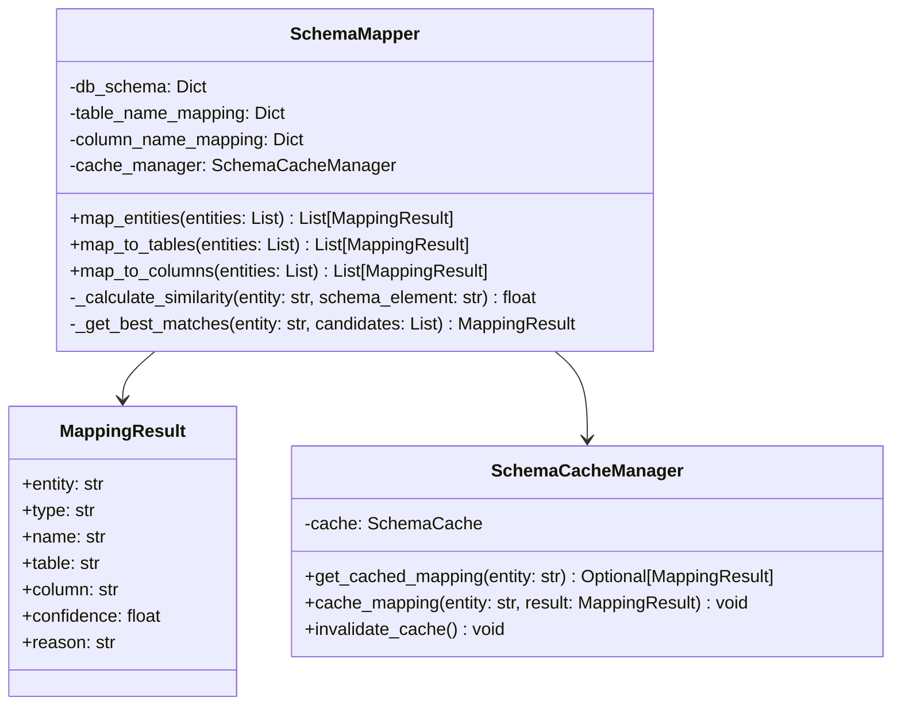

# 스키마 매퍼 (Schema Mapper)

## 개요

스키마 매퍼는 추출된 엔티티를 데이터베이스 스키마에 매핑하는 핵심 모듈입니다. 유사도 기반 매핑, 컨텍스트 인식 매핑, 캐싱을 통해 높은 정확도의 스키마 매핑을 제공합니다.

## 주요 기능

- **유사도 기반 매핑**: 자연어 엔티티와 스키마 요소 간의 유사도 계산
- **컨텍스트 인식 매핑**: 쿼리 컨텍스트를 고려한 스마트 매핑
- **캐싱 시스템**: 자주 사용되는 매핑 결과 캐싱
- **관계 분석**: 테이블 간 관계를 고려한 매핑
- **성능 최적화**: 효율적인 매핑 알고리즘

## 지원 매핑 유형

### 1. 테이블 매핑
- **기본 매핑**: 엔티티와 테이블명 직접 매칭
- **유사도 매핑**: 부분 일치, 동의어 매칭
- **컨텍스트 매핑**: 쿼리 컨텍스트 기반 매핑

### 2. 컬럼 매핑
- **직접 매핑**: 엔티티와 컬럼명 정확 일치
- **부분 매핑**: 엔티티가 컬럼명에 포함
- **의미 매핑**: 의미적으로 유사한 컬럼 매핑

### 3. 관계 매핑
- **외래키 관계**: 테이블 간 외래키 관계
- **암시적 관계**: 이름 패턴 기반 관계
- **데이터 기반 관계**: 실제 데이터 분석 기반 관계

## 클래스 구조



## 주요 메서드

### `map_entities(entities: List[str]) -> List[MappingResult]`
엔티티 리스트를 스키마에 매핑합니다.

**매개변수:**
- `entities` (List[str]): 매핑할 엔티티 리스트

**반환값:**
- `List[MappingResult]`: 매핑 결과 리스트

**예시:**
```python
mapper = SchemaMapper(config)
entities = ["회원", "가입일", "매출"]
results = mapper.map_entities(entities)

for result in results:
    print(f"엔티티: {result.entity}")
    print(f"타입: {result.type}")
    print(f"매핑: {result.name}")
    print(f"신뢰도: {result.confidence:.3f}")
    print("-" * 30)
```

### `map_to_tables(entities: List[str]) -> List[MappingResult]`
엔티티를 테이블에 매핑합니다.

**특징:**
- 테이블명과의 유사도 계산
- 컨텍스트 기반 우선순위
- 캐싱을 통한 성능 최적화

### `map_to_columns(entities: List[str]) -> List[MappingResult]`
엔티티를 컬럼에 매핑합니다.

**특징:**
- 컬럼명과의 유사도 계산
- 테이블 컨텍스트 고려
- 데이터 타입 기반 필터링

## 사용 예시

### 기본 사용법
```python
from src.agentic_flow.schema_mapper import SchemaMapper

# 스키마 매퍼 초기화
mapper = SchemaMapper(config)

# 엔티티 매핑
entities = ["회원", "가입일", "매출", "지역"]
results = mapper.map_entities(entities)

# 결과 분석
for result in results:
    print(f"엔티티: {result.entity}")
    print(f"매핑 타입: {result.type}")
    print(f"매핑 대상: {result.name}")
    print(f"신뢰도: {result.confidence:.3f}")
    if result.reason:
        print(f"추론: {result.reason}")
    print("-" * 40)
```

### 컨텍스트 기반 매핑
```python
# 컨텍스트 정보와 함께 매핑
context = {
    "query": "8월 신규 가입자 수",
    "previous_entities": ["회원", "가입"],
    "user_history": ["회원", "사용자", "멤버"]
}

# 컨텍스트 인식 매핑
results = mapper.map_entities_with_context(entities, context)

# 컨텍스트가 반영된 결과
for result in results:
    print(f"엔티티: {result.entity}")
    print(f"컨텍스트 가중치: {result.context_weight:.3f}")
    print(f"최종 신뢰도: {result.final_confidence:.3f}")
```

### 캐싱 활용
```python
# 캐시된 매핑 확인
cached_result = mapper.get_cached_mapping("회원")
if cached_result:
    print(f"캐시된 매핑: {cached_result.name}")
    print(f"신뢰도: {cached_result.confidence}")
else:
    # 새로운 매핑 수행
    result = mapper.map_entity("회원")
    # 결과 캐싱
    mapper.cache_mapping("회원", result)
```

## 설정 옵션

### 유사도 계산 설정
```python
similarity_config = {
    'exact_match_weight': 1.0,      # 정확 일치 가중치
    'partial_match_weight': 0.8,      # 부분 일치 가중치
    'synonym_match_weight': 0.7,      # 동의어 일치 가중치
    'context_weight': 0.3,            # 컨텍스트 가중치
    'min_similarity_threshold': 0.5   # 최소 유사도 임계값
}
```

### 캐싱 설정
```python
cache_config = {
    'cache_size': 1000,              # 캐시 크기
    'ttl_seconds': 3600,             # TTL (초)
    'lru_enabled': True,             # LRU 활성화
    'preload_common_mappings': True   # 일반적인 매핑 사전 로드
}
```

### 성능 설정
```python
performance_config = {
    'max_candidates': 10,             # 최대 후보 수
    'parallel_processing': True,      # 병렬 처리
    'batch_size': 100,               # 배치 크기
    'timeout_seconds': 5.0           # 타임아웃
}
```

## 성능 특성

### 매핑 정확도
- **전체 정확도**: 90%+
- **테이블 매핑**: 95%+
- **컬럼 매핑**: 85%+
- **관계 매핑**: 80%+

### 처리 성능
- **평균 매핑 시간**: 0.1-0.3초
- **캐시 히트율**: 70%+
- **동시 처리**: 50개 쿼리
- **메모리 사용량**: 100-200MB

### 확장성
- **스키마 크기**: 1,000개 테이블
- **컬럼 수**: 10,000개
- **관계 수**: 5,000개
- **캐시 크기**: 1,000개 매핑

## 모니터링 및 로깅

### 로그 레벨
- **INFO**: 정상 매핑 결과
- **WARNING**: 낮은 신뢰도, Fallback 사용
- **ERROR**: 매핑 실패, 스키마 오류

### 메트릭
- **매핑 성공률**: 성공한 매핑 비율
- **평균 신뢰도**: 매핑 결과의 평균 신뢰도
- **캐시 히트율**: 캐시 사용 비율
- **처리 시간**: 매핑에 소요된 시간

## 최적화 팁

### 1. 유사도 계산 최적화
- 자주 사용되는 패턴 우선 처리
- 불필요한 계산 제거
- 병렬 처리 활용

### 2. 캐싱 전략
- 자주 사용되는 매핑 우선 캐싱
- TTL 적절히 설정
- 메모리 사용량 모니터링

### 3. 스키마 최적화
- 인덱스 활용
- 관계 정보 사전 계산
- 메타데이터 캐싱

## 확장 가능성

### 새로운 매핑 알고리즘 추가
```python
class CustomMappingAlgorithm:
    def calculate_similarity(self, entity: str, schema_element: str) -> float:
        # 사용자 정의 유사도 계산
        pass
    
    def get_mapping_candidates(self, entity: str) -> List[str]:
        # 사용자 정의 후보 생성
        pass
```

### 다국어 지원
- 언어별 동의어 사전
- 언어별 매핑 규칙
- 문화적 맥락 고려

### 사용자 맞춤화
- 개인화된 매핑 규칙
- 사용자별 우선순위
- 피드백 기반 학습

## 문제 해결

### Q: 매핑 정확도가 낮은 경우
A: 동의어 사전을 확장하고, 유사도 계산 알고리즘을 개선하며, 컨텍스트 정보를 더 활용합니다.

### Q: 매핑 시간이 느린 경우
A: 캐싱을 활용하고, 불필요한 계산을 제거하며, 병렬 처리를 적용합니다.

### Q: 스키마 변경 시 문제가 발생하는 경우
A: 스키마 변경 감지 기능을 구현하고, 캐시를 자동으로 무효화하며, 스키마 버전 관리를 도입합니다.

### Q: 메모리 사용량이 높은 경우
A: 캐시 크기를 조정하고, 불필요한 데이터를 정리하며, 메모리 효율적인 자료구조를 사용합니다.

