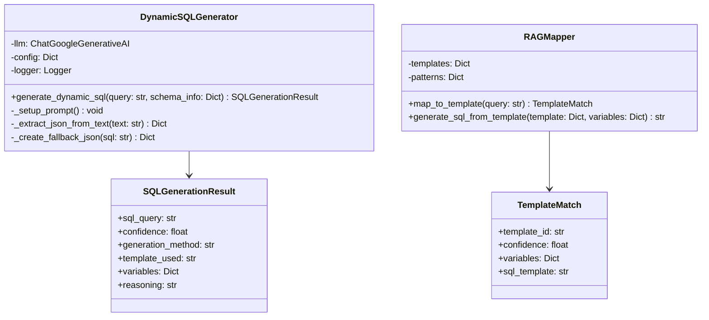

# SQL 생성기 (SQL Generator)

## 개요

SQL 생성기는 자연어 질의와 스키마 매핑 결과를 바탕으로 SQL 쿼리를 생성하는 핵심 모듈입니다. RAG 기반 템플릿 매칭과 LLM 기반 동적 생성을 결합하여 높은 정확도의 SQL을 생성합니다.

## 주요 기능

- **RAG 기반 생성**: 사전 정의된 SQL 템플릿과 매칭
- **동적 SQL 생성**: LLM을 사용한 지능형 SQL 생성
- **템플릿 변수 치환**: 동적 변수 치환 및 조건 생성
- **SQL 검증**: 생성된 SQL의 유효성 검증
- **Fallback 메커니즘**: 다중 생성 전략으로 안정성 보장

## 지원 SQL 유형

### 1. 기본 조회 (SELECT)
- **단순 조회**: 특정 테이블의 데이터 조회
- **조건 조회**: WHERE 절을 포함한 조건부 조회
- **정렬 조회**: ORDER BY를 포함한 정렬 조회

### 2. 집계 쿼리 (AGGREGATION)
- **COUNT**: 개수 집계
- **SUM**: 합계 집계
- **AVG**: 평균 집계
- **MAX/MIN**: 최대/최소값 집계

### 3. 그룹화 쿼리 (GROUP BY)
- **그룹별 집계**: 특정 컬럼으로 그룹화
- **HAVING 절**: 그룹 조건 필터링
- **다중 그룹화**: 여러 컬럼으로 그룹화

### 4. 조인 쿼리 (JOIN)
- **INNER JOIN**: 내부 조인
- **LEFT JOIN**: 왼쪽 외부 조인
- **RIGHT JOIN**: 오른쪽 외부 조인
- **FULL OUTER JOIN**: 완전 외부 조인

## 클래스 구조



## 주요 메서드

### `generate_dynamic_sql(query: str, schema_info: Dict) -> SQLGenerationResult`
자연어 질의를 SQL로 변환합니다.

**매개변수:**
- `query` (str): 변환할 자연어 질의
- `schema_info` (Dict): 스키마 정보 (테이블, 컬럼, 관계)

**반환값:**
- `SQLGenerationResult`: 생성된 SQL, 신뢰도, 생성 방법

**예시:**
```python
generator = DynamicSQLGenerator(config)
schema_info = {
    "tables": ["t_member", "t_member_login_log"],
    "columns": ["member_no", "ins_datetime", "status"],
    "relationships": [{"from": "t_member", "to": "t_member_login_log"}]
}

result = generator.generate_dynamic_sql("8월 신규 가입자 수", schema_info)
print(f"생성된 SQL: {result.sql_query}")
print(f"신뢰도: {result.confidence}")
print(f"생성 방법: {result.generation_method}")
```

### `map_to_template(query: str) -> TemplateMatch`
RAG 템플릿과 매칭합니다.

**특징:**
- 패턴 매칭을 통한 템플릿 선택
- 변수 추출 및 치환
- 신뢰도 기반 템플릿 선택

### `generate_sql_from_template(template: Dict, variables: Dict) -> str`
템플릿을 사용하여 SQL을 생성합니다.

**특징:**
- 동적 변수 치환
- 조건부 SQL 생성
- 오류 처리 및 Fallback

## 사용 예시

### 기본 사용법
```python
from src.agentic_flow.dynamic_sql_generator import DynamicSQLGenerator

# SQL 생성기 초기화
generator = DynamicSQLGenerator(config)

# 스키마 정보 설정
schema_info = {
    "tables": ["t_member", "t_member_login_log"],
    "columns": {
        "t_member": ["member_no", "status", "ins_datetime"],
        "t_member_login_log": ["member_no", "ins_datetime", "login_type"]
    },
    "relationships": [
        {"from": "t_member.member_no", "to": "t_member_login_log.member_no"}
    ]
}

# SQL 생성
query = "8월 신규 가입자 수를 알려줘"
result = generator.generate_dynamic_sql(query, schema_info)

# 결과 출력
print(f"생성된 SQL: {result.sql_query}")
print(f"신뢰도: {result.confidence:.3f}")
print(f"생성 방법: {result.generation_method}")
print(f"사용된 템플릿: {result.template_used}")
```

### RAG 템플릿 사용
```python
from src.agentic_flow.enhanced_rag_mapper import EnhancedRAGMapper

# RAG 매퍼 초기화
rag_mapper = EnhancedRAGMapper()

# 템플릿 매칭
query = "지난달 대비 이번달 매출 증가율"
template_match = rag_mapper.map_to_template(query)

if template_match:
    print(f"매칭된 템플릿: {template_match.template_id}")
    print(f"신뢰도: {template_match.confidence}")
    print(f"추출된 변수: {template_match.variables}")
    
    # SQL 생성
    sql = rag_mapper.generate_sql_from_template(
        template_match.template, 
        template_match.variables
    )
    print(f"생성된 SQL: {sql}")
```

### 복잡한 쿼리 생성
```python
# 복잡한 쿼리 예시
complex_query = "상위 5개 크리에이터의 회원 수를 알려줘"
schema_info = {
    "tables": ["t_creator", "t_member"],
    "columns": {
        "t_creator": ["creator_no", "creator_name"],
        "t_member": ["member_no", "creator_no"]
    },
    "relationships": [
        {"from": "t_creator.creator_no", "to": "t_member.creator_no"}
    ]
}

result = generator.generate_dynamic_sql(complex_query, schema_info)
print(f"복잡한 SQL: {result.sql_query}")
print(f"추론 과정: {result.reasoning}")
```

## 설정 옵션

### LLM 설정
```python
llm_config = {
    'model': 'gemini-1.5-pro',      # 사용할 모델
    'temperature': 0.1,             # 창의성 수준
    'max_tokens': 1000,             # 최대 토큰 수
    'request_timeout': 10.0,        # 요청 타임아웃
    'response_mime_type': 'application/json'  # JSON 응답 강제
}
```

### RAG 템플릿 설정
```python
template_config = {
    'template_path': 'src/agentic_flow/fanding_sql_templates.py',
    'pattern_path': 'src/agentic_flow/mapping_patterns.json',
    'confidence_threshold': 0.6,     # 템플릿 매칭 임계값
    'max_templates': 10,             # 최대 템플릿 수
    'fallback_enabled': True         # Fallback 활성화
}
```

### SQL 생성 설정
```python
generation_config = {
    'max_sql_length': 2000,         # 최대 SQL 길이
    'enable_joins': True,            # 조인 활성화
    'enable_subqueries': True,       # 서브쿼리 활성화
    'enable_cte': True,             # CTE 활성화
    'safety_checks': True            # 안전성 검사
}
```

## 성능 특성

### 생성 정확도
- **전체 정확도**: 85%+
- **단순 쿼리**: 95%+
- **복잡한 쿼리**: 75%+
- **RAG 템플릿**: 90%+

### 처리 성능
- **평균 생성 시간**: 2-5초
- **RAG 템플릿**: 0.5-1초
- **LLM 생성**: 3-8초
- **동시 처리**: 20개 쿼리

### 확장성
- **템플릿 수**: 100개
- **패턴 수**: 1,000개
- **변수 수**: 50개
- **쿼리 복잡도**: 10단계

## 모니터링 및 로깅

### 로그 레벨
- **INFO**: 정상 생성 결과
- **WARNING**: 낮은 신뢰도, Fallback 사용
- **ERROR**: 생성 실패, JSON 파싱 오류

### 메트릭
- **생성 성공률**: 성공한 생성 비율
- **평균 신뢰도**: 생성 결과의 평균 신뢰도
- **템플릿 사용률**: RAG 템플릿 사용 비율
- **처리 시간**: 생성에 소요된 시간

## 최적화 팁

### 1. 템플릿 최적화
- 자주 사용되는 패턴 우선 배치
- 템플릿 신뢰도 조정
- 변수 추출 정확도 개선

### 2. LLM 최적화
- 프롬프트 최적화
- 모델 선택 최적화
- 응답 형식 강제

### 3. 성능 최적화
- 캐싱 활용
- 병렬 처리 적용
- 불필요한 계산 제거

## 확장 가능성

### 새로운 SQL 유형 추가
```python
# 새로운 SQL 유형 정의
class SQLType(Enum):
    SELECT = "select"
    INSERT = "insert"
    UPDATE = "update"
    DELETE = "delete"
    # 새로운 유형 추가
    ANALYTICS = "analytics"
    REPORTING = "reporting"
```

### 다국어 지원
- 언어별 템플릿
- 언어별 패턴 정의
- 문화적 맥락 고려

### 사용자 맞춤화
- 개인화된 템플릿
- 사용자별 SQL 스타일
- 피드백 기반 개선

## 문제 해결

### Q: SQL 생성 정확도가 낮은 경우
A: 템플릿을 개선하고, LLM 프롬프트를 최적화하며, 스키마 정보를 더 상세히 제공합니다.

### Q: 생성 시간이 느린 경우
A: RAG 템플릿을 우선 사용하고, LLM 모델을 더 빠른 것으로 변경하며, 캐싱을 활용합니다.

### Q: JSON 파싱 오류가 자주 발생하는 경우
A: LLM 응답 형식을 강제하고, Fallback 메커니즘을 강화하며, 프롬프트를 개선합니다.

### Q: 복잡한 쿼리를 생성하지 못하는 경우
A: 더 많은 템플릿을 추가하고, LLM 모델을 업그레이드하며, 스키마 관계 정보를 더 활용합니다.

